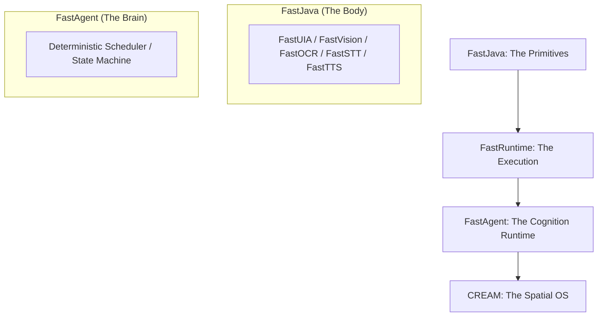
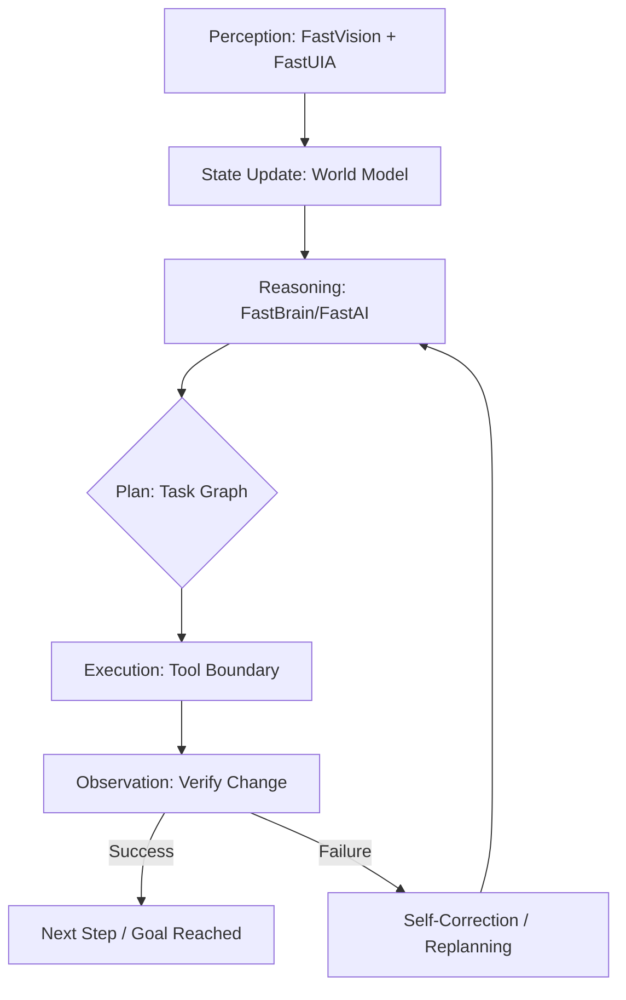

# FastAgent — Deterministic Agent Operating Model

[](https://github.com/andrestubbe/FastAgent/releases)
[](https://github.com/andrestubbe/FastAgent/actions)
[](https://www.java.com)
[]()
[](https://opensource.org/licenses/MIT)
[](https://github.com/andrestubbe/FastAgent)

**FastAgent is not an AI-assistant, not a chatbot, and not a prompt-wrapper. It is a deterministic Agent Operating Model (AOM) — a local-first execution layer for machine cognition.**

**FastAgent is not an Agent Framework, but an Agent Runtime Model with deterministic state, replay, and timeline.**

**FastAgent treats AI systems as operating systems problems, not prompt engineering problems.**

**FastAgent = Plan → Act → Observe → Adapt.**

---

## 1. The Thesis: Runtime vs. Framework
Most current agent systems are built on hidden state mutations and opaque prompt-stuffing. FastAgent treats agents as **Runtime Systems**, moving away from "AI Magic" toward **System Engineering**.

| Feature | Legacy Agent Frameworks | FastAgent Operating Model |
| :--- | :--- | :--- |
| **Foundation** | Chained Prompts / Hidden State | **Deterministic State Machine** |
| **Execution** | Stochastic / Unpredictable | **Replayable / Deterministic** |
| **Logic** | Implicit "Magic" Loops | **Explicit Phases (Plan → Act → Observe)** |
| **Scope** | IDE / Chat / Code | **OS-Level Task Execution (UI + Native)** |
| **Identity** | Assistant Tool | **System Layer / Runtime** |

---

## 1.1 The Dualism: Engine vs. Mind
To move beyond the limitations of legacy frameworks, FastAgent is built as a decoupled two-layer system.

### 1. FastRuntime (The Execution Engine)
The **Engine** is the deterministic substrate. It handles the low-level "Operating System" tasks of an agent.
- **Responsibility**: Frames, State Management, Timeline (CREAM), UIA Perception, Tool Boundaries.
- **Identity**: The Brain/Body.

### 2. FastAgent (The Cognitive Mind)
The **Mind** is the behavior layer. It is a "user-space" personality that runs on top of the FastRuntime.
- **Responsibility**: Goals, Intent Graphs, Strategic Policies, Personality, Knowledge.
- **Identity**: The Personality.

> **FastRuntime is the Engine. FastAgent is the Mind.**

---

## 2. Why FastAgent is NOT an Agent Framework
FastAgent is frequently compared to frameworks like **Agno**, **LangChain**, or **HKUDS-FastAgent**. This is a category error.

- **Frameworks** focus on connecting tools, generating JSON, and building prompt-based workflows. They are **stochastic libraries**.
- **FastAgent** is an **Execution Runtime**. It focuses on state semantics, deterministic scheduling, and OS-level observability.

> [!TIP]
> **See the full comparison matrix**: [Agent System Comparison](docs/comparison.md)  
> **Read the strategic positioning**: [Branding & Infrastructure Strategy](docs/branding_strategy.md)  
> **Explore the naming evolution**: [Beyond "Agent Framework" (Naming Analysis)](docs/naming_evolution.md)

---

## 3. The Divergence: Why Existing Frameworks Fail
Most "Unified Agent Systems" (e.g., Agno, LangChain) are built on **Stochastic Workflows**. They focus on connecting as many providers as possible, leading to:

- **Invisible State Mutation**: You can't see why the agent deviated.
- **Retry-Hell**: Failing tools are simply called again with the same parameters.
- **Hallucinated Loops**: No strictly defined state machine to prevent infinite recursion.
- **Opaque Context**: Prompts are stuffed with "Chat History" instead of structured system state.

### FastAgent vs. Stochastic Frameworks
| Feature | Stochastic Frameworks | FastAgent Runtime |
| :--- | :--- | :--- |
| **Logic** | Probability-based branching | **Deterministic State Machine** |
| **Reliability** | "Try again and hope" | **Verify & Replan** |
| **Debugging** | Print logs & Prompts | **Full State Replay** |
| **Philosophy** | Unified Glue / Wrapper | **Operating System Layer** |

> [!TIP]
> Read the full strategic overview: [Why FastAgent's Architecture Matters](docs/why-this-architecture-matters.md)

---

## 4. Chatbot vs. Runtime
The fundamental difference between FastAgent and traditional AI systems is the shift from **reactive speech** to **deterministic action**.

### Comparison Overview
| Feature | Chatbot (Reactive Text System) | FastAgent (Stateful Runtime) |
| :--- | :--- | :--- |
| **Model** | Input → LLM → Output | **State → Plan → Act → Observe → Replay** |
| **Capability** | Talking / Suggesting | **Acting / Executing** |
| **Nature** | A mouth without a body | **Brain + Body + Nervous System** |
| **Integrations**| API Wrappers | **OS-Level (Vision, UIA, CLI, Native)** |

### Architectural Contrast (ASCII)
```text
           CHATBOT                               RUNTIME
    (Reactive Text System)             (Stateful Execution Engine)
───────────────────────────────────────────────────────────────────

       ┌───────────────┐         ┌───────────► ┌──────────────────────┐
       │   User Input  │         │             │      AgentState      │
       └───────┬───────┘         │             │  (Task, Memory, UI)  │
               │                 │             └─────────┬────────────┘
               ▼                 │                       │
       ┌───────────────┐         │             ┌─────────▼────────────┐
       │      LLM      │         │             │       Planner        │
       │  (Text Only)  │         │             │  (Steps, Strategy)   │
       └───────┬───────┘         │             └─────────┬────────────┘
               │                 │                       │
               ▼                 │                       ▼
       ┌───────────────┐         │             ┌──────────────────────┐
       │  Text Output  │         │             │    Execution Loop    │
       └───────────────┘         │             │ Plan → Act → Observe │
                                 │             │      → Adjust        │
                                 │             └─────────┬────────────┘
                                 │                       │
                                 │                       ▼
                                 │             ┌──────────────────────┐
                                 │             │ Tools / UIA / Vision │
                                 │             │ (Act on Real System) │
                                 │             └─────────┬────────────┘
                                 │                       │
                                 │                       ▼
                                 │             ┌──────────────────────┐
                                 │             │    CREAM Timeline    │
                                 │             │ (Snapshots, Replay)  │
                                 └─────────────┴─────────┬────────────┘
                                                         │
                                                (Closed-Loop Feedback)
```

> **Chatbots talk. FastAgent acts.**

---

## 4. The Mind of an Agent: Persistent State & Timeline
FastAgent is the first agentic system where the "Mind" is not a black box, but a **transparent, deterministic state graph**.

### 4.1 From Fuzzy Memory to Immutable Tracks
Traditional agents rely on "Memory" (RAG, vector DBs, or recursive summaries), which inevitably becomes fuzzy, inaccurate, and uncontrollable over time. FastAgent replaces this with a **Timeline Track**.

- **Memory is dead. The Track is the future.** Instead of storing what the agent "thinks" it knows, we store exactly what the agent **was** at every millisecond.
- **Git for Thoughts**: Every perception, decision, and action is a Node in a persistent graph.
- **Zero-Loss Reconstruction**: Summaries are not stored; they are **reconstructed on-demand** from the immutable track, ensuring 100% accuracy and zero information decay.

### 4.2 Introspection & Debugging
Because the Mind is a Track of discrete states, you can:
1.  **Jump to any Step**: Open State #42 and see exactly what the UI looked like and what the agent was planning.
2.  **Deterministic Replay**: Provide the same seed and input to reproduce the exact same thought process.
3.  **Forking Futures**: Branch off from a specific state to test alternative agent strategies without losing the original path.

> **FastAgent is an MRI for Machine Cognition. You don't just see the output; you see the firing of every neuron in the execution loop.**

> [!TIP]
> **Explore the Mind Architecture**: [Mind Architecture (Schema & API)](docs/mind-architecture.md)  
> **See the Debugger Concept**: [Mind Debugger (UI & Features)](docs/mind-debugger.md)

---

## 5. Observable Execution Trace (Sample)
In FastAgent, every run produces a transparent, replayable trace:
```log
[04:00:01] STATE_COMMIT: WorldState updated (Notepad.exe detected)
[04:00:02] PLANNER_RESOLVE: Intent="Write Greeting" -> Steps=[TYPE, SAVE]
[04:00:03] TOOL_BOUNDARY: Call(uia.type, "Hello Andre")
[04:00:04] OBSERVATION: BufferChangeDetected(Text="Hello Andre")
[04:00:05] VERIFICATION: Success. Advancing to next step...
```

> [!NOTE]
> View a full step-by-step example: [Sample Notepad Execution Trace](docs/trace-notepad.md)

---

## 6. The Ecosystem Map: The Path to CREAM
FastAgent is the cognitive runtime in a larger evolution of native performance.



---

## 7. Design Principles

- **Deterministic by Default**: Equal Input + Equal Memory = Equal Execution path. Every transition is explicit and replayable.
- **Observable Execution**: Every action is inspectable through explicit runtime boundaries. Nothing mutates invisibly.
- **Structural Memory**: Memory is a queryable graph, not hidden prompt-stuffing. It is retained, structural, and replayable.
- **Tool Virtualization**: Tools execute through explicit execution boundaries to prevent uncontrolled side effects.
- **Infrastructure-First**: FastAgent is an OS-level execution engine for true autonomy — not a chatbot skin.

---

## 8. Technical Primer: The Agentic Loop
Unlike "Assistants" (Cursor/Windsurf) that help you think, FastAgent is a runtime that **helps you act** in a closed-loop system.



---

## 9. Architecture Overview
> [!IMPORTANT]
> For a deep dive into the system design, see: [Full Architecture Documentation](docs/architecture.md)

### 9.1 Agent State Model
To ensure determinism, the agent maintains a strictly typed, immutable state snapshot:
```text
AgentState {
  TaskState    // Current goals, steps, and progress
  MemoryState  // Context, past actions, and learned facts
  WorldState   // UI hierarchy, open windows, process list
  ErrorState   // Failure modes, recovery attempts, and thresholds
}
```

### 9.2 Anatomy of FastAgent (Internal Layers)
| Layer | Component | Responsibility |
|-------|-----------|----------------|
| **Core** | `FastAgentCore` | State Machine and Deterministic Scheduler. |
| **Memory** | `FastAgentMemory` | Structural persistence and context management. |
| **Tools** | `FastAgentTools` | Registry and execution boundaries for Tool-Chains. |
| **UI/Vision** | `FastAgentUI` | Native perception via FastUIA, FastVision, and FastOCR. |
| **Reasoning** | `FastAgentBrain` | Local inference engine (FastModel). |
| **Monitoring** | `FastAgentMonitor` | Feedback, error detection, and recovery. |

### 9.3 The FastAI Ecosystem (Module Matrix)
| Module | Role | Description |
| :--- | :--- | :--- |
| **FastModel** | Reasoning | Local GGUF/ONNX runtime & token management. |
| **FastVision** | Sight | Real-time screen analysis and visual context. |
| **FastOCR** | Reading | Native high-performance Optical Character Recognition. |
| **FastUIA** | Interaction | Deep UI automation and Accessibility Tree inspection. |
| **FastSTT** | Hearing | Native Speech-to-Text (Whisper/Native). |
| **FastTTS** | Voice | Native Text-to-Speech (Kokoro/Native). |
| **FastVectorDB**| Memory | SIMD-optimized retrieval store for RAG/Memory. |

---

## 10. Schemas (Deterministic I/O)

### 10.1 Planner Output Schema (Task Graph)
```json
{
  "steps": [
    { "action": "open_app", "target": "notepad" },
    { "action": "type", "text": "Hello Andre" },
    { "action": "save_file", "path": "Desktop/hello.txt" }
  ]
}
```

### 10.2 Tool Call Schema (Execution Boundary)
```json
{
  "tool": "uia.click",
  "args": { "selector": "FileMenu" }
}
```

---

## 11. Technical Sketches (Architectural Drafts)

### 11.1 The Agent Runtime Interface
```java
public interface FastAgent {
    // Static factory for version 0.1
    static FastAgent create() { return new FastAgentCore(); }

    /** Executes a high-level task through the deterministic runtime */
    void run(String goal);

    /** Returns an immutable snapshot of the current agent state */
    AgentState getSnapshot();
}
```

### 11.2 The Deterministic Execution Loop
```java
while (!state.task().isDone()) {
    // 1. Logic: Construct deterministic task graph
    Plan plan = planner.plan(state);
    
    // 2. Actuation: Execute through runtime boundaries
    Observation obs = executor.execute(plan.next());

    // 3. Verification: Observe state change & Commit memory
    state = monitor.update(state, obs);
}
```

---

## 12. Roadmap

### Phase 0 — Foundations (Current Stage)
- [x] Establish the Deterministic Operating Model Thesis
- [x] Define the FastJava → FastAgent → CREAM path
- [x] Define what FastAgent is / is not
- [x] Implement architecture diagrams & Schemas

### Phase 1 — AgentCore (v0.1 → v0.3)
**Goal**: Minimal runnable agent with deterministic loop.
- [ ] `FastAgentCore` class & Deterministic Scheduler
- [ ] Agent State Model (Task, Memory, World, Error)
- [ ] Execution Loop (Plan → Act → Observe → Adjust)
- [ ] Integration with `FastTool` & `FastToolChain`
- [ ] UI-Action Bridge (`FastUIA` + `FastVision` + `FastOCR`)

**Deliverable**: A minimal agent that can: *“Open Notepad → type → save file”.*

### Phase 2 — Intelligence Layer (v0.4 → v0.6)
**Goal**: Agent becomes adaptive, reflective, and context-aware.
- [ ] Memory v2 (Long-term + Vector Store)
- [ ] `FastVectorDB` + `FastRAG` integration
- [ ] Reflection Loop (Self-critique & correction)
- [ ] Human-in-the-Loop (Escalation for clarification)

### Phase 3 — Multi-Agent System (v0.7 → v0.9)
**Goal**: Specialized agents collaborating via A2A Protocol.
- [ ] Agent Router (Task delegation)
- [ ] Specialized Agents (Coding, Retrieval, UI, Citation)
- [ ] A2A Protocol & MCP Integration

### Phase 4 — Production Runtime (v1.0)
- [ ] Stable API & Security Sandbox
- [ ] Benchmark Suite (Latency, Reliability, Success Rate)
- [ ] Full Documentation & Demo Suite

---

## 13. Repository Structure (Proposed Skeletons)
```text
FastAgent/
 ├─ src/             # Core source code
 │   ├─ core/        # State Machine & Execution Loop
 │   │   ├─ FastAgentCore.java
 │   │   ├─ AgentState.java
 │   │   ├─ Planner.java
 │   │   ├─ Step.java
 │   │   └─ ExecutionLoop.java
 │   ├─ planner/     # Step Breakdown & LLM Integration
 │   ├─ memory/      # RAG & Context Management
 │   │   ├─ MemoryStore.java
 │   │   ├─ ShortTermMemory.java
 │   │   └─ LongTermMemory.java
 │   ├─ tools/       # Tool Registry & Bridge
 │   │   ├─ Tool.java
 │   │   ├─ ToolRegistry.java
 │   │   └─ ToolResult.java
 │   ├─ ui/          # FastUIA Integration
 │   │   ├─ UIAction.java
 │   │   ├─ UIContext.java
 │   │   └─ UIExecutor.java
 │   ├─ vision/      # FastVision & OCR Bridge
 │   │   ├─ VisionProvider.java
 │   │   └─ Screenshot.java
 │   └─ router/      # Multi-Agent Orchestration
 │       ├─ AgentRouter.java
 │       └─ SubAgent.java
 ├─ examples/        # Demo applications
 ├─ docs/            # Technical documentation
 └─ README.md
```

---

---

## 14. CREAM — The Temporal Context Engine
**CREAM** (Context Reconstruction Engine & Activity Model) is the optional temporal layer for FastAgent. Originally conceived as a **2.5D Spatial File Explorer & CLI**, CREAM now serves as the "System Memory" and "Timeline" for the agentic runtime.

### 14.1 From Explorer to Engine
*   **Original Concept**: A "Google Earth for Files" — a spatial, 2.5D interface for navigating file histories and system events via CLI.
*   **Agent Integration**: In FastAgent, CREAM provides the **Temporal Dimension**. While other agents live in an eternal "now," FastAgent + CREAM live in a reconstructible timeline.

### 14.2 Why CREAM Matters
- **Deterministic Replay**: CREAM archives Task-State, World-State, and UI-Snapshots, allowing a developer to replay any agent run exactly as it happened.
- **Timeline-First UI**: Instead of a chat history, FastAgent provides a **Temporal Execution Trace** (Plan → Step → Tool → Observation).
- **System-Level Memory**: Not just "prompt-stuffing." CREAM allows the agent to reconstruct "What happened?", "Why?", and "How did the UI look back then?"

> **CREAM is the reason FastAgent is a Runtime, not a Chatbot.**

---

## 16. The Execution Kernel: Frames & Intents
FastAgent does not run loose loops; it operates on a **Deterministic Frame Schedule**, treating AI autonomy as an Operating System problem.

### 16.1 Deterministic Frames (The System Heartbeat)
Following the architecture of Game Engines and OS Schedulers, FastAgent divides execution into discrete **Frames**. Each frame follows a rigid sequence to ensure 100% replayability:
1.  **Ingest Phase**: Collect system events and capture UI/Vision snapshots.
2.  **Internal Phase**: Update Memory (Commit) and resolve the Intent Graph.
3.  **Actuation Phase**: Execute tools and verify state transitions.
4.  **Commit Phase**: Archive the frame to the CREAM Timeline.

### 16.2 Hierarchical Intent Graph
Instead of a static list of tasks, FastAgent maintains a dynamic **Execution Intent Graph**.
- **Adaptive**: High-level intents (e.g., "Fix Bug") dynamically spawn sub-intents (Research, Plan, Simulate, Execute, Verify).
- **Self-Correcting**: If a verification phase fails, the graph automatically injects a "Recovery" sub-intent to the schedule.

> [!TIP]
> **Deep Dive into Scheduling**: [Frames & Intent Scheduling](docs/frames-and-scheduling.md)

---

## 17. Philosophy
Traditional software executes functions. **FastAgent executes evolving systems.**

The goal is not better prompts; it is **deterministic machine cognition infrastructure**. FastAgent is the missing link in the evolution from primitives to spatial operating environments:

**FastJava → FastRuntime → FastAgent → CREAM (Spatial OS)**

---
**Made with ⚡ by Andre Stubbe**

<!-- 
SEO Keywords: agentic ai, autonomous agents, java agents, jni, windows api, fastjava, state machine, local llm, automation, rag, vectordb, execution engine, machine cognition, agent operating model, spatial os
-->
