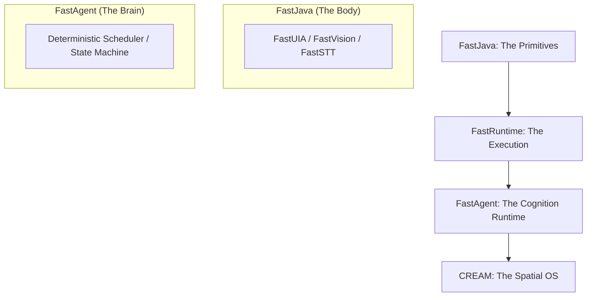
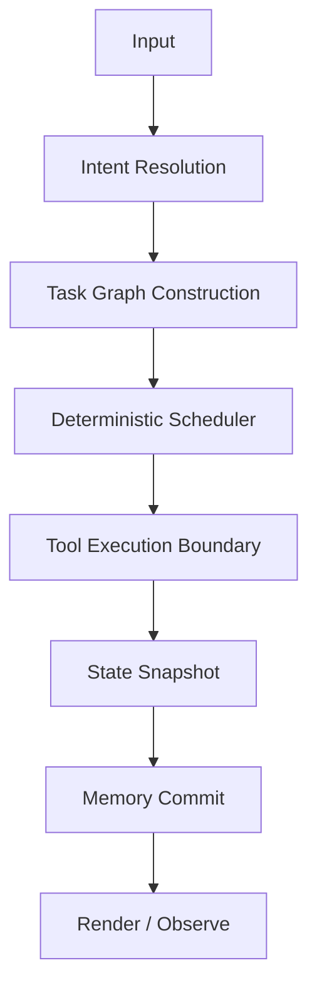

# FastAgent — Deterministic Agent Operating Model

[](https://github.com/andrestubbe/FastAgent/releases)
[](https://github.com/andrestubbe/FastAgent/actions)
[](https://www.java.com)
[]()
[](https://opensource.org/licenses/MIT)
[](https://github.com/andrestubbe/FastAgent)

**FastAgent is not an AI-assistant, not a chatbot, and not a prompt-wrapper. It is a deterministic Agent Operating Model (AOM) — a local-first execution layer for machine cognition.**

---

## 1. The Thesis: Operating Model vs. Framework
Most modern "Agents" are stochastic loops wrapped in chat interfaces. FastAgent is **Infrastructure**.

| Feature | Legacy Agent Frameworks | FastAgent Operating Model |
| :--- | :--- | :--- |
| **Foundation** | Chained Prompts / Hidden State | **Deterministic State Machine** |
| **Execution** | Stochastic / Unpredictable | **Replayable / Deterministic** |
| **Logic** | Implicit "Magic" Loops | **Explicit Phases (Plan → Act → Observe)** |
| **Scope** | IDE / Chat / Code | **OS-Level Task Execution (UI + Native)** |
| **Identity** | Assistant Tool | **System Layer / Runtime** |

---

## 2. The Ecosystem Map: The Path to CREAM
FastAgent is the cognitive runtime in a larger evolution of native performance.



---

## 3. Core Principles: Engineering over Hype
FastAgent moves away from "AI Magic" toward **System Engineering**:

- **Deterministic by Default**: Equal Input + Equal Memory = Equal Execution. Every run is reproducible.
- **Structural Memory**: Memory is a queryable graph, not hidden prompt-stuffing.
- **UI-Perception & Action**: Deep integration with `FastVision` and `FastUIA` for real-world Windows automation.
- **Observable Tool Boundaries**: Every native tool call is a virtualized boundary with explicit inputs and outputs.
- **Traceable Execution**: A complete timeline of events, from Intent Resolution to State Commit.

---

## 4. Technical Primer: The Agentic Loop
Unlike "Assistants" (Cursor/Windsurf) that help you think, FastAgent is a runtime that **helps you act**.



---

## 5. Architecture Overview

### 5.1 Agent State Model
The runtime maintains a strictly typed, immutable state snapshot at every step:
```text
AgentState {
  TaskState    // Goals & Progress
  MemoryState  // Structural Context
  WorldState   // UI Hierarchy & OS Environment
  ErrorState   // Failure Modes & Recovery Traces
}
```

### 5.2 The FastAI Anatomy
| Module | Role | Backend |
| :--- | :--- | :--- |
| **FastModel** | Reasoning | Local GGUF/ONNX Runtime |
| **FastVision** | Sight | GPU Screen Analysis |
| **FastUIA** | Interaction | Native Accessibility Tree |
| **FastSTT/TTS**| Communication | Native Audio I/O |
| **FastVectorDB**| Memory | SIMD-optimized Retrieval |

---

## 6. Technical Sketches (Architectural Drafts)

### 6.1 The Agent Runtime Loop
```java
while (!state.task().isDone()) {
    // 1. Logic: Construct deterministic task graph
    Plan plan = planner.plan(state);
    
    // 2. Actuation: Execute through runtime boundaries
    Observation obs = executor.execute(plan.next());

    // 3. Verification: Observe state change & Commit memory
    state = monitor.update(state, obs);
}
```

---

## 7. Roadmap: Foundations to Spatial OS

### Phase 0 — Foundations (Current Stage)
- [x] Establish the Deterministic Operating Model Thesis
- [x] Define the FastJava → FastAgent → CREAM path
- [x] Implement architecture diagrams & Schemas

### Phase 1 — AgentCore (v0.1)
- [ ] `FastAgentCore` Deterministic Scheduler
- [ ] Agent State Model (Immutable Snapshots)
- [ ] Execution Loop (Plan → Act → Observe → Adjust)

### Phase 2 — Multi-Agent & Production (v0.4+)
- [ ] A2A Protocol (Agent-to-Agent Messaging)
- [ ] Security Sandbox & Deterministic Replay
- [ ] Autonomous runtime composition

---

## 8. Philosophy
Traditional software executes functions. **FastAgent executes evolving systems.**

The goal is not better prompts; it is **deterministic machine cognition infrastructure**. FastAgent is the runtime for a world where AI doesn't just assist, but acts as a reliable, observable layer of the operating system.

---
**Made with ⚡ by Andre Stubbe**

<!-- 
SEO Keywords: agentic ai, autonomous agents, java agents, jni, windows api, fastjava, state machine, local llm, automation, rag, vectordb, execution engine, machine cognition, agent operating model
-->
