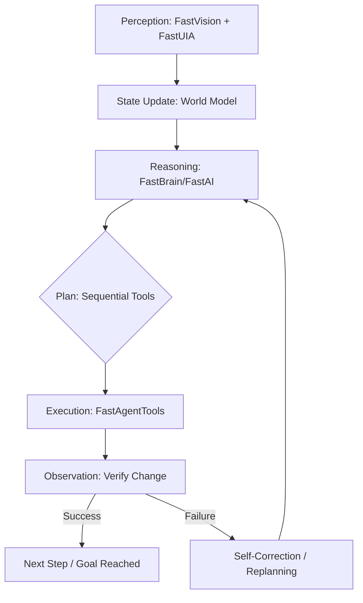

# FastAgent — The Deterministic Agentic Primer

**FastAgent is the execution layer that turns FastAI into an autonomous system. It is not a chatbot; it is a stateful runtime for real-world actuation.**

FastAgent is currently in **Alpha (v0.1.0)**. Our roadmap involves perfecting each sub-module before fusing them into a unified, high-performance software application.

---

## 🚀 The Fusion Vision
The end goal of FastAgent is not just a library, but the **Fusion** of all FastJava components into a single, cohesive autonomous entity. We are building the subparts independently to ensure zero-overhead performance, which will eventually be orchestrated by the FastAgent runtime.

---

## 1. The Core Thesis: Beyond the Chatbot Loop
Most modern "Agents" are just LLMs wrapped in a loop that generates JSON and hopes for the best. FastAgent moves from **probabilistic prompting** to **deterministic execution**.

### Why most agents fail:
- **Infinite Loops**: The model gets stuck asking itself the same questions.
- **Hallucinated Tools**: Calling APIs that don't exist.
- **Environment Blindness**: No real-time feedback from the UI or OS.
- **State Fragmentation**: Losing track of complex, multi-step goals.

### How FastAgent solves this:
FastAgent uses a **Hierarchical State Machine** to manage tasks. Every action is observed, every outcome is verified, and every failure triggers a deterministic recovery path.

---

## 2. The Anatomy of FastAgent (Modular Layers)
FastAgent is not a monolithic application; it is a stack of specialized, deterministic layers:

| Layer | Component | Responsibility |
|-------|-----------|----------------|
| **Core** | `FastAgentCore` | The State Machine and execution planner. |
| **Memory** | `FastAgentMemory` | Persistent world model (FastVectorDB + FastRAG). |
| **Tools** | `FastAgentTools` | The registry and execution engine for tool chains. |
| **UI/Vision** | `FastAgentUI` | UI automation and screen understanding (FastUIA + FastVision). |
| **Reasoning** | `FastAgentBrain` | The local inference engine (FastModel). |
| **Monitoring** | `FastAgentMonitor` | Self-correction, error detection, and recovery. |
| **Router** | `FastAgentRouter` | Multi-agent orchestration via A2A protocol. |

## 3. The Multi-Modal Body (Grounding)
A brain without a body is just a chatbot. FastAgent integrates the full FastJava stack to interact with Windows:

- **Eyes (`FastVision` + `FastUIA`)**: It doesn't just read text; it understands the visual layout and the accessibility tree of the OS.
- **Hands (`FastRobot` + `FastInputHook`)**: It performs native mouse/keyboard actions at driver-level speed.
- **Memory (`FastVectorDB` + `FastRAG`)**: It maintains a persistent "World Model" of your files, open windows, and past successes.

---

## 4. The Execution Mechanics: Plan -> Act -> Observe
FastAgent follows a strict, non-recursive execution cycle:

1.  **Decomposition**: The `FastAgentCore` breaks a high-level goal into a sequence of `FastTool` calls.
2.  **Verification**: Before acting, it checks the pre-conditions (e.g., "Is the window open?").
3.  **Actuation**: It executes the tool chain via JNI for zero-latency.
4.  **Observation**: `FastAgentMonitor` inspects the environment to confirm the intended state change.
5.  **Reflection**: It updates its internal state and replans only if the observation deviates from the expectation.

---

## 5. Technical Primer: The Agentic Loop
Unlike a standard chatbot, FastAgent operates in a **Closed-Loop System**. It does not assume success; it verifies it.

### The Irreducible Capabilities:
1.  **State**: Persistent memory and an internal "World Model" (where am I? what is open?).
2.  **Planning**: Multi-step reasoning *before* acting, selecting the most efficient tool chain.
3.  **Actuation**: Real-world effects via native Windows APIs.
4.  **Self-Correction**: Reflection and error recovery via the `FastAgentMonitor`.

## 6. Multi-Agent Orchestration (A2A Protocol)
FastAgent is designed to spawn and coordinate specialized sub-agents via the **Agent-to-Agent (A2A)** protocol:

| Agent Role | Responsibility | Module Backend |
|------------|----------------|----------------|
| **UI Agent** | Navigating and interacting with complex apps. | `FastUIA` |
| **Data Agent** | Processing local files and databases. | `FastFileSystem` |
| **Logic Agent** | High-level reasoning and decision making. | `FastAI` |
| **System Agent** | Managing processes, services, and hardware. | `FastProcess` |

---

## 7. The Roadmap: Where We Are Going
This is not just a library; it's a blueprint for an **Autonomous OS Layer**.

- [ ] **Phase 1: Deterministic Tooling** (Current) — Reliable tool execution and state tracking.
- [ ] **Phase 2: Visual Grounding** — Full integration with `FastVision` for "Eyes-on" navigation.
- [ ] **Phase 3: Human-in-the-loop (HITL)** — Intelligent escalation when uncertainty exceeds thresholds.
- [ ] **Phase 4: Swarm Intelligence** — Seamless multi-agent collaboration across the local network.

---

## 8. Premium Architecture
FastAgent is built for **Latency, Privacy, and Control.**
- **100% Local**: No data leaves your machine.
- **JNI Driven**: Native performance for system-level actions.
- **Zero Dependencies**: Pure Java/C++ stack.

---
**"FastAgent is the system that turns AI reasoning into real-world results."**

<!-- 
SEO Keywords: agentic ai, autonomous agents, deterministic ai, local llm, java native interface, fastjava, state machine agents
-->
