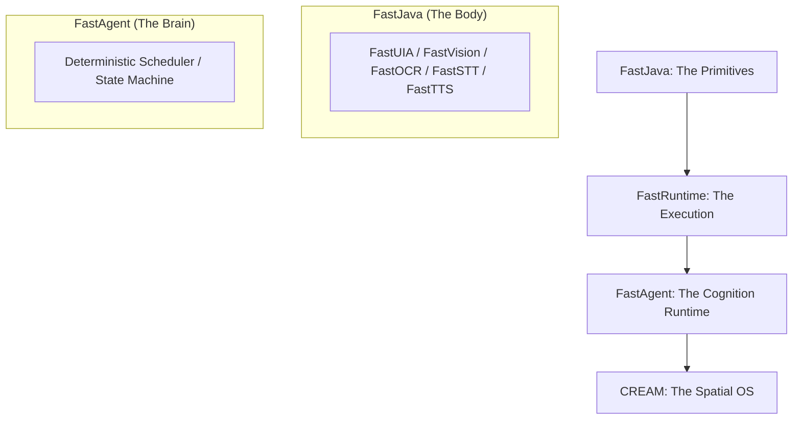
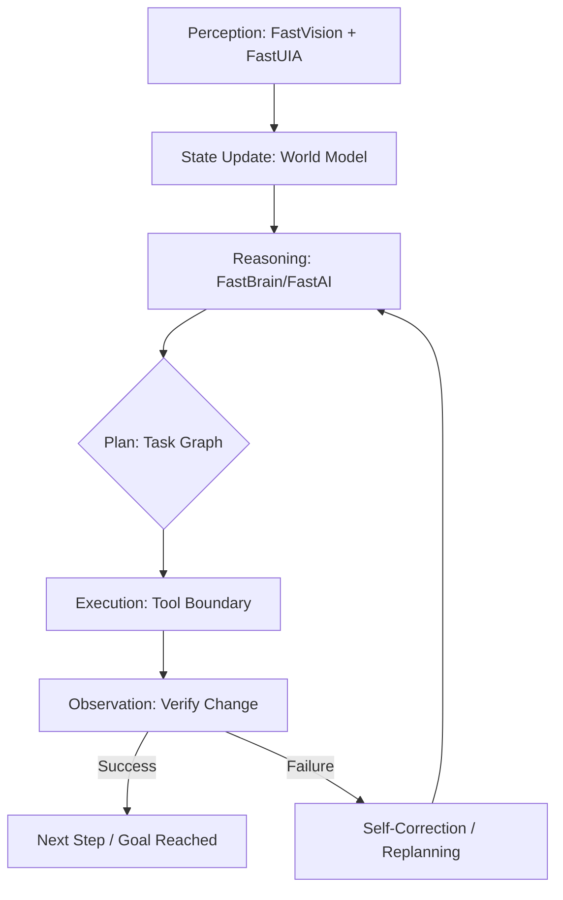

# FastAgent — Deterministic Agent Operating Model

[](https://github.com/andrestubbe/FastAgent/releases)
[](https://github.com/andrestubbe/FastAgent/actions)
[](https://www.java.com)
[]()
[](https://opensource.org/licenses/MIT)
[](https://github.com/andrestubbe/FastAgent)

**FastAgent is not an AI-assistant, not a chatbot, and not a prompt-wrapper. It is a deterministic Agent Operating Model (AOM) — a local-first execution layer for machine cognition.**

**FastAgent = Plan → Act → Observe → Adapt.**

---

## 1. The Thesis: Runtime vs. Framework
Most current agent systems are built on hidden state mutations and opaque prompt-stuffing. FastAgent treats agents as **Runtime Systems**, moving away from "AI Magic" toward **System Engineering**.

| Feature | Legacy Agent Frameworks | FastAgent Operating Model |
| :--- | :--- | :--- |
| **Foundation** | Chained Prompts / Hidden State | **Deterministic State Machine** |
| **Execution** | Stochastic / Unpredictable | **Replayable / Deterministic** |
| **Logic** | Implicit "Magic" Loops | **Explicit Phases (Plan → Act → Observe)** |
| **Scope** | IDE / Chat / Code | **OS-Level Task Execution (UI + Native)** |
| **Identity** | Assistant Tool | **System Layer / Runtime** |

---

## 2. The Ecosystem Map: The Path to CREAM
FastAgent is the cognitive runtime in a larger evolution of native performance.



---

## 3. Design Principles

- **Deterministic by Default**: Equal Input + Equal Memory = Equal Execution path. Every transition is explicit and replayable.
- **Observable Execution**: Every action is inspectable through explicit runtime boundaries. Nothing mutates invisibly.
- **Structural Memory**: Memory is a queryable graph, not hidden prompt-stuffing. It is retained, structural, and replayable.
- **Tool Virtualization**: Tools execute through explicit execution boundaries to prevent uncontrolled side effects.
- **Infrastructure-First**: FastAgent is an OS-level execution engine for true autonomy — not a chatbot skin.

---

## 4. Technical Primer: The Agentic Loop
Unlike "Assistants" (Cursor/Windsurf) that help you think, FastAgent is a runtime that **helps you act** in a closed-loop system.



---

## 5. Architecture Overview

### 5.1 Agent State Model
To ensure determinism, the agent maintains a strictly typed, immutable state snapshot:
```text
AgentState {
  TaskState    // Current goals, steps, and progress
  MemoryState  // Context, past actions, and learned facts
  WorldState   // UI hierarchy, open windows, process list
  ErrorState   // Failure modes, recovery attempts, and thresholds
}
```

### 5.2 Anatomy of FastAgent (Internal Layers)
| Layer | Component | Responsibility |
|-------|-----------|----------------|
| **Core** | `FastAgentCore` | State Machine and Deterministic Scheduler. |
| **Memory** | `FastAgentMemory` | Structural persistence and context management. |
| **Tools** | `FastAgentTools` | Registry and execution boundaries for Tool-Chains. |
| **UI/Vision** | `FastAgentUI` | Native perception via FastUIA, FastVision, and FastOCR. |
| **Reasoning** | `FastAgentBrain` | Local inference engine (FastModel). |
| **Monitoring** | `FastAgentMonitor` | Feedback, error detection, and recovery. |

### 5.3 The FastAI Ecosystem (Module Matrix)
| Module | Role | Description |
| :--- | :--- | :--- |
| **FastModel** | Reasoning | Local GGUF/ONNX runtime & token management. |
| **FastVision** | Sight | Real-time screen analysis and visual context. |
| **FastOCR** | Reading | Native high-performance Optical Character Recognition. |
| **FastUIA** | Interaction | Deep UI automation and Accessibility Tree inspection. |
| **FastSTT** | Hearing | Native Speech-to-Text (Whisper/Native). |
| **FastTTS** | Voice | Native Text-to-Speech (Kokoro/Native). |
| **FastVectorDB**| Memory | SIMD-optimized retrieval store for RAG/Memory. |

---

## 6. Schemas (Deterministic I/O)

### 6.1 Planner Output Schema (Task Graph)
```json
{
  "steps": [
    { "action": "open_app", "target": "notepad" },
    { "action": "type", "text": "Hello Andre" },
    { "action": "save_file", "path": "Desktop/hello.txt" }
  ]
}
```

### 6.2 Tool Call Schema (Execution Boundary)
```json
{
  "tool": "uia.click",
  "args": { "selector": "FileMenu" }
}
```

---

## 7. Technical Sketches (Architectural Drafts)

### 7.1 The Agent Runtime Interface
```java
public interface FastAgent {
    // Static factory for version 0.1
    static FastAgent create() { return new FastAgentCore(); }

    /** Executes a high-level task through the deterministic runtime */
    void run(String goal);

    /** Returns an immutable snapshot of the current agent state */
    AgentState getSnapshot();
}
```

### 7.2 The Deterministic Execution Loop
```java
while (!state.task().isDone()) {
    // 1. Logic: Construct deterministic task graph
    Plan plan = planner.plan(state);
    
    // 2. Actuation: Execute through runtime boundaries
    Observation obs = executor.execute(plan.next());

    // 3. Verification: Observe state change & Commit memory
    state = monitor.update(state, obs);
}
```

---

## 8. Roadmap

### Phase 0 — Foundations (Current Stage)
- [x] Establish the Deterministic Operating Model Thesis
- [x] Define the FastJava → FastAgent → CREAM path
- [x] Define what FastAgent is / is not
- [x] Implement architecture diagrams & Schemas

### Phase 1 — AgentCore (v0.1 → v0.3)
**Goal**: Minimal runnable agent with deterministic loop.
- [ ] `FastAgentCore` class & Deterministic Scheduler
- [ ] Agent State Model (Task, Memory, World, Error)
- [ ] Execution Loop (Plan → Act → Observe → Adjust)
- [ ] Integration with `FastTool` & `FastToolChain`
- [ ] UI-Action Bridge (`FastUIA` + `FastVision` + `FastOCR`)

**Deliverable**: A minimal agent that can: *“Open Notepad → type → save file”.*

### Phase 2 — Intelligence Layer (v0.4 → v0.6)
**Goal**: Agent becomes adaptive, reflective, and context-aware.
- [ ] Memory v2 (Long-term + Vector Store)
- [ ] `FastVectorDB` + `FastRAG` integration
- [ ] Reflection Loop (Self-critique & correction)
- [ ] Human-in-the-Loop (Escalation for clarification)

### Phase 3 — Multi-Agent System (v0.7 → v0.9)
**Goal**: Specialized agents collaborating via A2A Protocol.
- [ ] Agent Router (Task delegation)
- [ ] Specialized Agents (Coding, Retrieval, UI, Citation)
- [ ] A2A Protocol & MCP Integration

### Phase 4 — Production Runtime (v1.0)
- [ ] Stable API & Security Sandbox
- [ ] Benchmark Suite (Latency, Reliability, Success Rate)
- [ ] Full Documentation & Demo Suite

---

## 9. Repository Structure
```text
FastAgent/
 ├─ src/             # Core source code
 │   ├─ core/        # State Machine & Execution Loop
 │   ├─ planner/     # Step Breakdown & LLM Integration
 │   ├─ memory/      # RAG & Context Management
 │   ├─ tools/       # Tool Registry & Bridge
 │   ├─ ui/          # FastUIA Integration
 │   ├─ vision/      # FastVision & OCR Bridge
 │   └─ router/      # Multi-Agent Orchestration
 ├─ examples/        # Demo applications
 ├─ docs/            # Technical documentation
 └─ README.md
```

---

## 10. Philosophy
Traditional software executes functions. **FastAgent executes evolving systems.**

The goal is not better prompts; it is **deterministic machine cognition infrastructure**. FastAgent is the missing link in the evolution from primitives to spatial operating environments:

**FastJava → FastRuntime → FastAgent → CREAM (Spatial OS)**

---
**Made with ⚡ by Andre Stubbe**

<!-- 
SEO Keywords: agentic ai, autonomous agents, java agents, jni, windows api, fastjava, state machine, local llm, automation, rag, vectordb, execution engine, machine cognition, agent operating model, spatial os
-->
