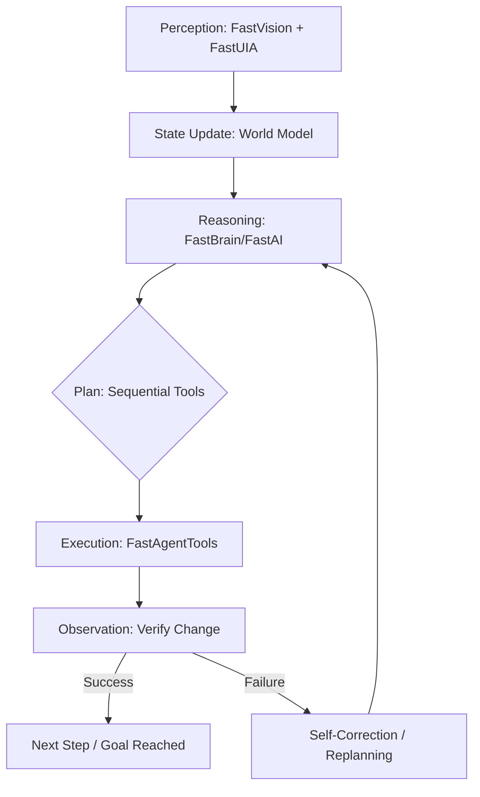

# FastAgent — Roadmap to a Real Agentic Runtime

[](https://github.com/andrestubbe/FastAgent/releases)
[](https://github.com/andrestubbe/FastAgent/actions)
[](https://www.java.com)
[]()
[](https://opensource.org/licenses/MIT)
[](https://github.com/andrestubbe/FastAgent)

**FastAgent is not a chatbot, not a workflow engine wrapper, and not a planner loop. FastAgent is a deterministic, stateful, tool-capable agent runtime core built on the FastJava ecosystem.**

**FastAgent = Plan → Act → Observe → Adapt.**

---

## 1. Vision
FastAgent aims to be the first local, modular, deterministic agent runtime system that:
- **Uses real State Machines** (no infinite prompt loops)
- **Executes Tools and UI-Automation securely** (via JNI/FastUIA)
- **Integrates Memory and RAG** (FastVectorDB)
- **Detects errors** and can replan autonomously
- **Orchestrates Sub-Agents** (A2A Protocol)
- **Runs completely offline** on GPU/CPU

> **No Agent Zoos. No Hallucination APIs. No 500-line Prompts.**

---

## 2. Technical Primer: The Agentic Loop
Unlike standard chatbot wrappers, FastAgent operates in a **Closed-Loop System**. We do not assume success; we verify it.



---

## 3. Architecture Overview

### 3.1 Agent State Model
To ensure determinism, the agent maintains a strictly typed state:
```text
AgentState {
  TaskState    // Current goals, steps, and progress
  MemoryState  // Context, past actions, and learned facts
  WorldState   // UI hierarchy, open windows, process list
  ErrorState   // Failure modes, recovery attempts, and thresholds
}
```

### 3.2 Anatomy of FastAgent (Internal Layers)
| Layer | Component | Responsibility |
|-------|-----------|----------------|
| **Core** | `FastAgentCore` | State Machine and Execution Planner. |
| **Memory** | `FastAgentMemory` | Short-term + Long-term memory (RAG). |
| **Tools** | `FastAgentTools` | Registry and execution for tool chains. |
| **UI/Vision** | `FastAgentUI` | UI automation and screen understanding. |
| **Reasoning** | `FastAgentBrain` | Local inference engine (FastModel). |
| **Monitoring** | `FastAgentMonitor` | Feedback, error detection, and recovery. |
| **Router** | `FastAgentRouter` | Multi-agent orchestration via A2A. |

### 3.3 The FastAI Ecosystem (Module Matrix)
| Module | Role | Description |
| :--- | :--- | :--- |
| **FastModel** | Reasoning | Local GGUF/ONNX runtime & token management. |
| **FastVision** | Sight | Real-time screen analysis and visual context. |
| **FastOCR** | Reading | Native high-performance Optical Character Recognition. |
| **FastUIA** | Interaction | Deep UI automation and Accessibility Tree inspection. |
| **FastSTT** | Hearing | Native Speech-to-Text (Whisper/Native). |
| **FastTTS** | Voice | Native Text-to-Speech (Kokoro/Native). |
| **FastVectorDB**| Memory | SIMD-optimized retrieval store for RAG/Memory. |

---

## 4. Schemas (Deterministic I/O)

### 4.1 Planner Output Schema
The Brain must output a structured list of actionable steps:
```json
{
  "steps": [
    { "action": "open_app", "target": "notepad" },
    { "action": "type", "text": "Hello Andre" },
    { "action": "save_file", "path": "Desktop/hello.txt" }
  ]
}
```

### 4.2 Tool Call Schema
The Execution engine maps these steps to specific native tools:
```json
{
  "tool": "uia.click",
  "args": { "selector": "FileMenu" }
}
```

---

## 5. Roadmap

### Phase 0 — Foundations (Current Stage)
**Goal**: Define the mental model of FastAgent.
- [x] Define what FastAgent is / is not
- [x] Establish the 4‑Box Architecture
- [x] Create Minimal Example
- [x] Establish extended roadmap & module definitions
- [x] Implement architecture diagrams

### Phase 1 — AgentCore (v0.1)
**Goal**: Minimal deterministic agent loop.
- [ ] `FastAgentCore` class & implementation
- [ ] Agent State Model (Task, Memory, World, Error)
- [ ] Planner v1 (LLM → Step List)
- [ ] Execution Loop (Plan → Act → Observe → Adjust)
- [ ] Logging + Trace (Deterministic replay)

**Deliverable**: Agent can execute a simple multi-step task using mock tools.

### Phase 2 — Tools & UI (v0.2)
**Goal**: Real actions in the OS.
- [ ] Tool Registry integration
- [ ] `FastTool` & `FastToolChain` bridge
- [ ] `FastUIA` + `FastVision` + `FastOCR` integration
- [ ] Error detection (UI mismatch, tool failure)

**Deliverable**: Agent can: *“Open Notepad → type → save file”.*

### Phase 3 — Memory & RAG (v0.3)
**Goal**: Agent becomes stateful and context-aware.
- [ ] Short-term + Long-term memory
- [ ] `FastVectorDB` + `FastRAG` integration
- [ ] Reflection Loop (Self-critique & correction)

### Phase 4 — Multi-Agent System (v0.4)
**Goal**: Specialized agents collaborating via A2A Protocol.
- [ ] Agent Router (Task delegation)
- [ ] Specialized Agents (Coding, Retrieval, UI, Citation)
- [ ] A2A Protocol & MCP Integration

### Phase 5 — Production Runtime (v1.0)
- [ ] Stable API & Security Sandbox
- [ ] JSON Command Schema finalized
- [ ] Benchmark Suite & Full Documentation

---

## 6. Repository Structure
```text
FastAgent/
 ├─ src/             # Core source code
 │   ├─ core/        # State Machine & Execution Loop
 │   ├─ planner/     # Step Breakdown & LLM Integration
 │   ├─ memory/      # RAG & Context Management
 │   ├─ tools/       # Tool Registry & Bridge
 │   ├─ ui/          # FastUIA Integration
 │   ├─ vision/      # FastVision & OCR Bridge
 │   └─ router/      # Multi-Agent Orchestration
 ├─ examples/        # Demo applications
 ├─ docs/            # Technical documentation
 └─ README.md
```

---

## 7. Minimal Example (v0.1)
```java
FastAgent agent = FastAgent.create();

// The agent plans, acts, and verifies the result autonomously.
agent.run("Open Notepad, write 'Hello Andre', save it to Desktop.");
```

---

## 8. Philosophy
FastAgent is not "AutoGPT for Java." FastAgent is an **OS-level Execution Engine** for true autonomy:
- **Understands the World** (Vision + UIA)
- **Plans Steps** | **Executes Tools** | **Observes Results** | **Corrects Errors** | **Learns from Experience**

**An agent that actually works, not just talks.**

---
**Made with ⚡ by Andre Stubbe**

<!-- 
SEO Keywords: agentic ai, autonomous agents, java agents, jni, windows api, fastjava, state machine, local llm, automation, rag, vectordb, execution engine
-->
