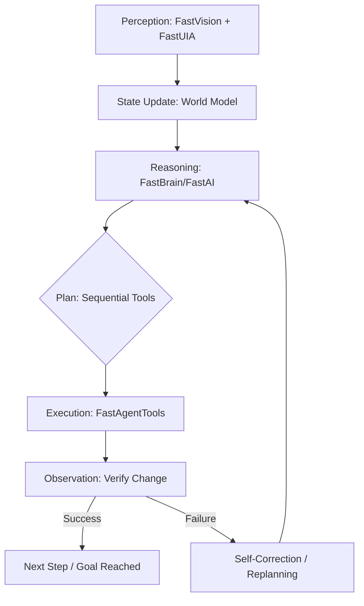

# FastAgent — Roadmap to a Real Agentic Runtime

[](https://github.com/andrestubbe/FastAgent/releases)
[](https://github.com/andrestubbe/FastAgent/actions)
[](https://www.java.com)
[]()
[](https://opensource.org/licenses/MIT)
[](https://github.com/andrestubbe/FastAgent)

**FastAgent ist kein Chatbot, kein Workflow‑Engine‑Wrapper und kein Planner‑Loop. FastAgent ist ein deterministischer, zustandsbehafteter, tool‑fähiger Agent‑Runtime‑Core, der auf dem FastAI-Ecosystem aufsetzt.**

**FastAgent = Planen → Handeln → Beobachten → Anpassen.**

---

## 1. Vision
FastAgent soll das erste lokale, modulare, deterministische Agent‑Runtime‑System werden, das:
- **Echte State Machines** nutzt (keine unendlichen Prompt-Loops)
- **Tools und UI‑Automation** sicher ausführt (via JNI/FastUIA)
- **Memory und RAG** integriert (FastVectorDB)
- **Fehler erkennt** und autonom replanten kann
- **Sub‑Agents** orchestriert (A2A-Protokoll)
- **Komplett offline** auf GPU/CPU läuft

> **Kein Agent‑Zoo. Keine Halluzinations‑APIs. Keine 500‑Zeilen‑Prompts.**

---

## 2. Technical Primer: Der Agentic Loop
Im Gegensatz zu reinen LLM-Wrappern arbeitet FastAgent in einem **Closed-Loop System**. Wir gehen nicht von Erfolg aus; wir verifizieren ihn.



---

## 3. Architecture Overview

### 3.1 Die Anatomie von FastAgent (Internal Layers)
| Layer | Komponente | Aufgabe |
|-------|-----------|----------------|
| **Core** | `FastAgentCore` | State Machine und Execution Planner. |
| **Memory** | `FastAgentMemory` | Short‑Term + Long‑Term Memory (RAG). |
| **Tools** | `FastAgentTools` | Registry und Execution für Tool-Chains. |
| **UI/Vision** | `FastAgentUI` | UI-Automation und Screen-Understanding. |
| **Reasoning** | `FastAgentBrain` | Lokale Inference Engine (FastModel). |
| **Monitoring** | `FastAgentMonitor` | Feedback, Error Detection und Recovery. |
| **Router** | `FastAgentRouter` | Multi-Agent Orchestrierung via A2A. |

### 3.2 Das FastAI Ecosystem (Modul-Matrix)
FastAgent ist das Bindeglied zwischen Gehirn (FastAI) und Körper (Windows-Native).

| Add‑On | Mini‑Beschreibung |
| :--- | :--- |
| **FastModel** | Lokale GGUF/ONNX Runtime & Token Management. |
| **FastVision** | Bildanalyse, OCR, Screenshots, UI‑Kontext. |
| **FastVectorDB** | SIMD‑optimierter Retrieval‑Store für RAG/Memory. |
| **FastToolChain** | Deterministische Tool-Sequenzen (kein Chaos). |
| **FastAudio** | Native Speech‑to‑Text (STT) & Text‑to‑Speech (TTS). |
| **FastGuard** | Lokale Safety/Filter & Guardrails. |

---

## 4. Roadmap

### Phase 1 — Foundations (v0.1 → v0.3)
**Ziel**: Minimaler lauffähiger Agent mit deterministischem Loop.
- [x] Definition Agent State Model (Task, Memory, World, Error)
- [ ] Implementierung Planner v1 (LLM-based Step Breakdown)
- [ ] Implementierung Execution Loop (Plan → Act → Observe)
- [ ] Integration Tool Registry (FastTool + FastToolChain)
- [ ] UI-Action Bridge (FastUIA Integration)
- [ ] Vision Bridge (FastVision Screenshot + OCR)
- [ ] Memory v1 (Short-Term only)
- [ ] Logging + Trace (Deterministisches Replay)

**Deliverable**: Ein minimaler Agent, der z.B. Notepad öffnen, Text schreiben und speichern kann.

### Phase 2 — Intelligence Layer (v0.4 → v0.6)
**Ziel**: Agent wird adaptiv, reflektierend und kontextbewusst.
- [ ] Memory v2 (Long-Term + Vector Store)
- [ ] RAG Integration (FastRAG + FastVectorDB)
- [ ] Reflection Loop (Self-Critique + Correction)
- [ ] Error Detection (UI Mismatch, Tool Failure, Invalid State)
- [ ] Replanning Engine (Retry mit neuer Strategie)
- [ ] Human-in-the-Loop (Rückfrage bei Unklarheiten)

**Deliverable**: Der Agent bewältigt mehrstufige Aufgaben zuverlässig, auch bei UI-Änderungen.

### Phase 3 — Multi‑Agent System (v0.7 → v0.9)
**Ziel**: Spezialisierte Agenten kollaborieren via A2A Protokoll.
- [ ] Agent Router (Task Delegation)
- [ ] Specialized Agents (Coding, Retrieval, UI, Citation)
- [ ] A2A Protocol (Agent-to-Agent Messaging)
- [ ] MCP Integration (Optionale externe Tools)

**Deliverable**: Ein System, in dem Agenten sich wie Microservices koordinieren.

### Phase 4 — Production Runtime (v1.0)
**Ziel**: Stabile, dokumentierte und erweiterbare Agent-Plattform.
- [ ] Stable API (Java + JSON Command Schema)
- [ ] Plugin System (Third-party Tools + Agents)
- [ ] Security Sandbox (Tool Permissions, UI Scopes)
- [ ] Benchmark Suite (Latency, Reliability, Success Rate)
- [ ] Demo Suite & Documentation

**Deliverable**: FastAgent v1.0 — eine vollständige lokale Agent-Runtime.

---

## 5. Minimal Example (v0.1)
```java
FastAgent agent = FastAgent.create();

// Der Agent plant, handelt und verifiziert das Ergebnis autonom.
agent.run("Open Notepad, write 'Hello Andre', save it to Desktop.");
```

---

## 6. Philosophy
FastAgent ist nicht “AutoGPT für Java”. FastAgent ist ein **OS‑Level Execution Engine** für echte Autonomie:
- **Versteht die Welt** (Vision + UIA)
- **Plant Schritte** | **Führt Tools aus** | **Beobachtet Ergebnisse** | **Korrigiert Fehler** | **Lernt aus Erfahrung**

**Ein Agent, der wirklich arbeitet, nicht nur redet.**

---
**Made with ⚡ by Andre Stubbe**

<!-- 
SEO Keywords: agentic ai, autonomous agents, java agents, jni, windows api, fastjava, state machine, local llm, automation, rag, vectordb
-->
