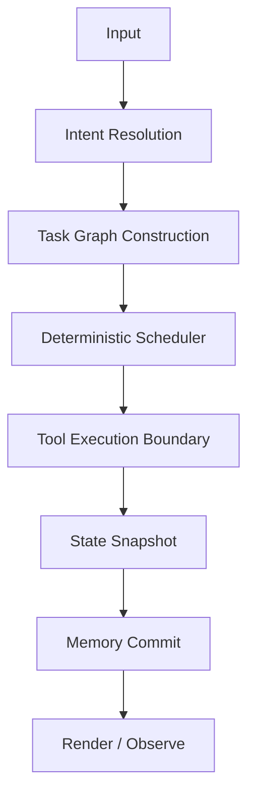

# FastAgent — Deterministic Agentic Runtime

[](https://github.com/andrestubbe/FastAgent/releases)
[](https://github.com/andrestubbe/FastAgent/actions)
[](https://www.java.com)
[]()
[](https://opensource.org/licenses/MIT)
[](https://github.com/andrestubbe/FastAgent)

**FastAgent is a deterministic agent runtime for building persistent, observable, and composable AI systems. It is not another prompt-chaining framework; it is an infrastructure layer for autonomous execution.**

---

## 1. The Thesis: Runtime vs. Chat Wrapper
Most current agent systems are built on hidden state mutations and opaque prompt-stuffing. FastAgent treats agents as **Runtime Systems**, focusing on:

- **Deterministic Task Scheduling**
- **Explicit Execution Phases**
- **Immutable State Snapshots**
- **Structural Memory Persistence**
- **Observable Tool Boundaries**
- **Retained Execution Graphs**

### Why this matters
Traditional "agents" (chained prompts) are nearly impossible to debug, replay, or scale. FastAgent ensures that **Equal Input + Equal Memory = Equal Execution Path.**

---

## 2. Core Execution Model
FastAgent operates through a strictly defined, observable pipeline:



---

## 3. Design Principles

- **Deterministic by Default**: Reasoning is represented as retained execution state, ensuring replayable transitions.
- **Observable Execution**: Every action is inspectable. No uncontrolled side effects or invisible state mutations.
- **Structural Memory**: Memory is a queryable graph, not a hidden text buffer.
- **Tool Virtualization**: Tools execute through explicit runtime boundaries, ensuring safety and reliability.
- **Infrastructure-First**: FastAgent is a runtime for machine cognition, not a chatbot skin.

---

## 4. Architecture Overview

### 4.1 Anatomy of FastAgent (Internal Layers)
| Layer | Component | Responsibility |
|-------|-----------|----------------|
| **Core** | `FastAgentCore` | State Machine and Execution Planner. |
| **Memory** | `FastAgentMemory` | Structural persistence and RAG. |
| **Tools** | `FastAgentTools` | Explicit runtime boundaries for native tools. |
| **UI/Vision** | `FastAgentUI` | System perception via FastUIA & FastVision. |
| **Reasoning** | `FastAgentBrain` | Local inference engine (FastModel). |
| **Monitoring** | `FastAgentMonitor` | Feedback, error detection, and recovery. |

### 4.2 The FastAI Ecosystem (Module Matrix)
| Module | Role | Description |
| :--- | :--- | :--- |
| **FastModel** | Reasoning | Local GGUF/ONNX runtime & token management. |
| **FastVision** | Sight | Real-time screen analysis and visual context. |
| **FastOCR** | Reading | Native high-performance Optical Character Recognition. |
| **FastUIA** | Interaction | Deep UI automation and Accessibility Tree inspection. |
| **FastSTT** | Hearing | Native Speech-to-Text (Whisper/Native). |
| **FastTTS** | Voice | Native Text-to-Speech (Kokoro/Native). |
| **FastVectorDB**| Memory | SIMD-optimized retrieval store for RAG/Memory. |

---

## 5. Schemas (Deterministic I/O)

### 5.1 Planner Output Schema (Task Graph)
```json
{
  "steps": [
    { "action": "open_app", "target": "notepad" },
    { "action": "type", "text": "Hello Andre" },
    { "action": "save_file", "path": "Desktop/hello.txt" }
  ]
}
```

### 5.2 Tool Call Schema (Execution Boundary)
```json
{
  "tool": "uia.click",
  "args": { "selector": "FileMenu" }
}
```

---

## 6. Technical Sketches

### 6.1 The Agent Runtime Interface
```java
public interface FastAgent {
    // Static factory for version 0.1
    static FastAgent create() { return new FastAgentCore(); }

    /** Executes a high-level task through the deterministic runtime */
    void run(String goal);

    /** Returns an immutable snapshot of the current agent state */
    AgentState getSnapshot();
}
```

### 6.4 The Deterministic Execution Loop
The core cycle of FastAgent ensures that every transition is verifiable and every state change is logged:

```java
while (!state.task().isDone()) {
    // 1. Logic: What should happen next?
    Plan plan = planner.plan(state);
    Step step = plan.nextStep();

    // 2. Actuation: Perform the native action
    Observation obs = executor.execute(step);

    // 3. Verification: Did it work?
    state = monitor.update(state, obs);
    
    // Optional: Log snapshot for deterministic replay
    log.snapshot(state);
}
```

---

## 7. Roadmap

### Phase 0 — Foundations (Current Stage)
- [x] Establish the Deterministic Runtime Thesis
- [x] Define the 4‑Box Architecture & Module Matrix
- [x] Implement architecture diagrams & Schemas

### Phase 1 — AgentCore (v0.1)
- [ ] `FastAgentCore` class & implementation
- [ ] Agent State Model (Task, Memory, World, Error)
- [ ] Execution Loop (Plan → Act → Observe → Adjust)

### Phase 2 — Multi-Agent & Production (v0.4+)
- [ ] A2A Protocol & Multi-agent scheduling
- [ ] Security Sandbox & Stable JSON API
- [ ] Autonomous runtime composition

---

## 8. Philosophy
Traditional software executes functions. **FastAgent executes evolving systems.**

The goal is not better prompts. The goal is **deterministic machine cognition infrastructure**. FastAgent is the missing link in the evolution from primitives to spatial operating environments:

**FastJava → FastRuntime → FastAgent → CREAM (Spatial OS)**

---
**Made with ⚡ by Andre Stubbe**

<!-- 
SEO Keywords: agentic ai, autonomous agents, java agents, jni, windows api, fastjava, state machine, local llm, automation, rag, vectordb, execution engine, machine cognition
-->
